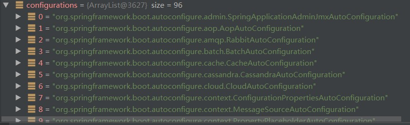
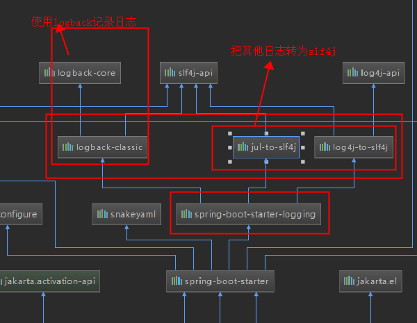
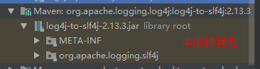
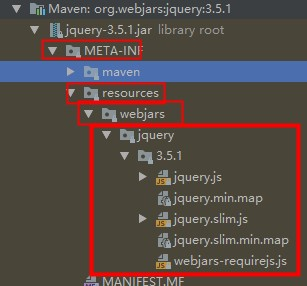
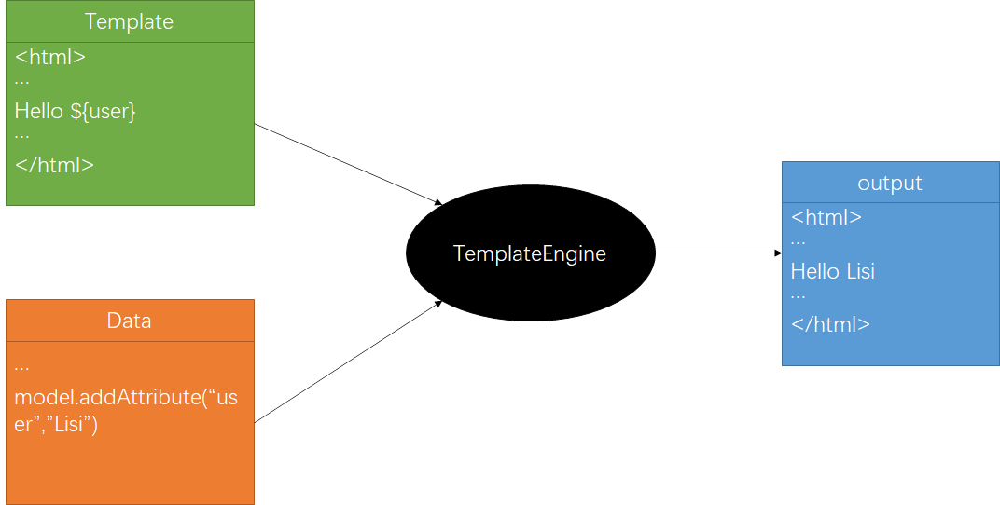

# 一、SpringBoot入门

## 1. springBoo简介

[SpringBoot官方文档](https://docs.spring.io/spring-boot/docs/2.3.2.RELEASE/reference/htmlsingle/)

    简化Spring应用开发的一个框架；
    整个Spring技术栈的一个大整合；
    J2EE开发的一站式解决方案。


## 2. 微服务

2014，matin fowler
微服务：架构风格
一个应用应该是一组小型服务：可以通过HTTP的方式进行互通

每一个功能元素最终都是一个可独立替换和独立升级的软件单元。

学习SpringBoot必须掌握以下内容：

* Spring框架使用的经验[谷粒学院](http://www.gulixueyuan.com/)
* 环境约束：
* jdk1.8:spring boot 1.7及以上 java =version
* maven3.x  mvn -v
* IntellijIDEA2017、STS
* SpringBoot 1.5.9RELEASE

## 3.统一环境

### MAVEN设置

给maven的settings.xml配置文件的profiles标签添加

```xml
<profile>
    <id>jdk-1.8</id>
    <activation>
        <activeByDefault>true</activeByDefault>
        <jdk>1.8</jdk>
    </activation>
    <properties>
        <maven.compiler.source>1.8</maven.compiler.source>
        <maven.compiler.target>1.8</maven.compiler.target>
        <maven.compiler.compilerVersion>1.8</maven.compiler.compilerVersion>
    </properties>
</profile>
```

## 4.SpringBoot HelloWorld

一个功能: 浏览器发送hello请求，服务器接收请求并处理，响应helloworld字符串。

### 4.1 创建一个maven工程（jar)

### 4.2 导入springBoot的依赖

```xml
<parent>
        <groupId>org.springframework.boot</groupId>
        <artifactId>spring-boot-starter-parent</artifactId>
        <version>1.5.2.RELEASE</version>
    </parent>
    <dependencies>
        <dependency>
            <groupId>org.springframework.boot</groupId>
            <artifactId>spring-boot-starter-web</artifactId>
        </dependency>
    </dependencies>
```


### 4.3 编写一个主程序

```java
/**
@SpringBoorApplication:标注一个主程序类，说明这是一个Spring Boot应用
 */
@SpringBootApplication
public class HelloWorldMainApplication {
    public static void main(String [] args){
        //Spring应用启动起来
        SpringApplication.run(HelloWorldMainApplication.class,args);
    }
}
```

### 4.4 编写相关的Controller、Service

```java
@Controller
public class HelloController {
    
    @ResponseBody
    @RequestMapping("/hello")
    public String hello(){
        return "Hello World";
        
    }
}
```

### 4.5 运行主程序

### 4.6 简化部署

```xml
<!--这个插件可以应用打包成一个可执行的jar包-->
    <build>
        <plugins>
            <plugin>
                <groupId>org.springframework.boot</groupId>
                <artifactId>spring-boot-maven-plugin</artifactId>
            </plugin>
        </plugins>
    </build>
```

将这个应用打成jar包，直接使用java -jar的命令进行执行

## 5.HelloWorld探究

### 5.1 POM文件

父项目

```xml
<parent>
    <groupId>org.springframework.boot</groupId>
    <artifactId>spring-boot-starter-parent</artifactId>
    <version>1.5.2.RELEASE</version>
</parent>
他的父项目是
<parent>
    <groupId>org.springframework.boot</groupId>
    <artifactId>spring-boot-dependencies</artifactId>
    <version>1.5.2.RELEASE</version>
    <relativePath>../../spring-boot-dependencies</relativePath>
</parent>
他来真正管理SpringBoot应用里面的所有依赖版本；
```

Spring Boot的版本仲裁中心：

以后我们导入依赖默认是不需要写版本；（没有在dependencies里面管理的依赖自然需要声明版本号）

### 5.2 导入的依赖

```xml
<dependency>
    <groupId>org.springframework.boot</groupId>
    <artifactId>spring-boot-starter-web</artifactId>
</dependency>	
```

spring-boot-starter-web:

spring-boot-starter:spring-boot场景启动器；帮我们导入了web模块正常运行所依赖的组件；

SpringBoot将所有的功能场景都抽取出来做成一个个的starters(启动器)，只需要在项目里引入这些starter相关场景的所有依赖都会导入进来。要用什么功能就导入什么场景的启动器

### 5.3主程序类，主入口类


@SpringBootApplication: SpringBoot应用标注在某个类上说明这个类是SpringBoot的主配置类，SpringBoot就应该运行这个类的main方法来启动SpringBoot应用

```java
@Inherited
@SpringBootConfiguration
@EnableAutoConfiguration
@ComponentScan(
    excludeFilters = {@Filter(
    type = FilterType.CUSTOM,
    classes = {TypeExcludeFilter.class}
), @Filter(
    type = FilterType.CUSTOM,
    classes = {AutoConfigurationExcludeFilter.class}
)}
)
public @interface SpringBootApplication {	
```

@**SpringBootConfiguration** SpringBoot的配置类；标注在某个类上，表示这是一个SpringBoot的配置类；

​		@**Configuration** 配置类上来标注这是个注解；配置类......配置文件；

​		配置类也是容器的一个组件；@Component

@**EnableAutoConfiguration** 开启自动配置功能

​		以前我们需要配置的东西，SpringBoot帮我们自动配置；@**EnableAutoConfiguration** 告诉SpringBoot开始自动配置功能；这样自动配置才能生效。

```java
@AutoConfigurationPackage
@Import({EnableAutoConfigurationImportSelector.class})
public @interface EnableAutoConfiguration {
```

@**AutoConfigurationPackage** 自动配置包

​	@Import({Registrar.class})： Spring的底层注解，给容器中导入一个组件；导入的组件有Registrar.class

​	**将主配置类（@SpringBootApplication标注的类）的所在包及下面所有子包里面的所有组件扫描到Spring容器**，若不在主程序类所在包下的包或者类将不能够被找到。

​	@Import({EnableAutoConfigurationImportSelector.class})将所有需要导入的组件以全类名的方式返回，这些组件就会被添加到容器中；会给容器中导入非常多的自动配置类；就是给容器这个场景需要的所有组件，并配置好

​	spring注解版（谷粒学院）



有了自动配置类，就免去了我们手动编写配置和注入功能组件等的工作；

**SpringFactoriesLoader.loadFactoryNames（EnableAutoConfiguration.class，classLoader）从类路径下的"META-INF/spring.factories"中获取EnableAutoConfiguration指定的值，将这些值作为自动配置类导入到容器中，自动配置类就生效，帮我们进行自动配置工作**；以前我们需要自己配置的东西，自动配置类帮我们完成了。

J2EE整体整合解决方案和自动配置都在spring-boot-autoconfigure-1.5.9.RELEASE.jar;

## 6.使用Spring Initializer快速创建SpringBoot项目

IDE都支持使用spring的项目，快速创建一个springboot项目：

选择我们需要的模块；向导会联网SpringBoot创建项目；

默认生成的SpringBoot项目；

* 主程序已经生成好了，只需要编写业务逻辑
* resources文件夹中的目录结构
  * static:保存所有的静态资源；js css images;
  * templates:保存所有的模板页面；（springBoot默认jar包使用嵌入式的tomcat,默认不支持jsp页面）；可以使用模板引擎（freemarker,thymeleaf）;
  * application.properties:SpringBoot应用的配置文件，可以修改一些默认设置

# 二、配置文件

## 1.配置文件

SpringBoot使用一个全局的配置文件，配置文件名是固定的；

* application.properties
* application.yml

配置文件的作用：修改SpringBoot自动配置的默认值；springBoot在底层都给我们自动配置好

YAML是一个标记语言，不是一个标记语言

标记语言：

​		以前的配置文件，大多都使用的是**xxx.xml**文件；	

​		YAML 以数据为中心，比json,xml等更适合做配置文件

## 2.YAML语法

### 2.1 基本语法

```yaml
k: v 标识一个键值对（空格必须有）
以空格的缩进来控制层级关系；只有左对齐的一列数据都是同一个层级的
server: 
	port: 8081
	path: /hello
属性和值都是大小写敏感的	
```


### 2.2 值的写法

#### 字面量；普通的值（数字、字符串、布尔）

k: v字面量直接写，自粗创不用加上单引号或者双引号；""双引号不会转义字符串里面的特殊字符；特殊字符会作为本身想表示的意思，‘’单引号回转义特殊字符，特殊字符最终只是一个普通的字符串数据

```yaml
name: "zhangsan\nlisi" 输出：zhangsan换行李四
name: 'zhangsan\nlisi' 输出：zhangsan\nlisi
```

#### 对象、Map（属性和值/键值对）

K: V对象还是k: v的方式

```yaml
friends:
	lastname: zhangsan
	age: 20
```

行内写法：

```yaml
friends: {lastname: zhangsan,age: 18}
```

#### 数组

用-值表示数组中的一个元素

```yaml
pets:
	- car
	- dog
	- pig
```

行内写法：

```yaml
pets: [cat,dog,pig]
```

### 2.3 配置文件值注入

#### ConfigurationProperties全局配置文件进行属性自动注入

```yaml
person:
  lastName: hello
  age: 19
  boss: false
  birth: 2017/12/12
  maps: {k1: v1,k2: 12}
  lists:
    - lisi
    - zhaoliu
  dog:
    name: 小狗
    age: 2
```

javabean

```java
/**
 * 将配置文件中配置的每一个属性的值，映射到这个组件
 * @ConfigurationProperties:告诉SpringBoot将本类中的所有属性和配置文件中相关的配置进行绑定
 *  prefix = "person"：配置文件中哪个下面的所有属性进行一一映射
 *
 *  只有这个组件是容器中组件，才能使用容易提供的功能
 */

@Component
@ConfigurationProperties(prefix = "person")
public class Person {
    private String lastName;
    private Integer age;
    private Boolean boss;
    private Date birth;

    private Map<String,Object> maps;
    private List<Object> lists;
    private Dog dog;

```

我们可以导入配置文件处理器，以后编写配置就有提示了

```xml
<!--导入配置文件处理器-->
		<dependency>
			<groupId>org.springframework.boot</groupId>
			<artifactId>spring-boot-configuration-processor</artifactId>
			<optional>true</optional>
		</dependency>
```

properties配置文件默认为utf8编码，若出现乱码，可以在设置中file encoding将其转为ascii

```java
<property name="lastName" value="字面量/${key}从环境变量或配置文件中取值/#{SpEL}springExpressionLanguage表达式">
@Value注解也可以对属性的值进行注入
```

两种对javaBean注入值的区别

|                | @ConfigurationProperties | @Value     |
| -------------- | ------------------------ | ---------- |
| 功能           | 批量注入配置文件中的属性 | 一个个指定 |
| 松散语法绑定   | 支持                     | 不支持     |
| SpEL           | 不支持                   | 支持       |
| JSR303数据校验 | 支持                     | 不支持     |

配置文件yml还是properties都能获取值

如果只是在某个业务逻辑中获取一下配置文件中的某项值，就使用@Value

#### @PropertySource、@ImportResource

* @PropertySource只能用于properties文件，读取指定文件而不是全局的配置文件

  ```java
  //写一个对应bean.properties,将配置上的属性值自动绑定到对应bean的属性
  
  @PropertySource(value = {"classpath:bean.properties"})
  public class Bean{
      //...
  }
  ```

* @ImportResource读取外部配置文件，让配置文件里面的内容生效.

  springboot里面灭有Spring的配置文件，我们自己写的配置文件也不能自动识别，

  想让spring的配置文件生效加载进来，把@ImportResource标注在一个类上

  ```java
  //写一个beans.xml，使用<bean>标签进行属性值绑定
  @ImportResource(locations = "classpath:beans.xml")
  public class Bean{
      //...
  }
  ```

* SpringBoot推荐给容器中添加组件的方式：推荐使用全注解的方式

  ```java
  /**
   * @Configuration 指明当前类是一个配置类，就是来代替之前的spring配置文件
   *
   * 在配置文件中用<bean></bean>标签添加组件
   */
  @Configuration
  public class MyConfig {
  
      //将方法的返回值添加到容器中；容器中的组件默认的id就是方法名
      @Bean
      public SemanticAnalysis semanticAnalysis(){
          return new SemanticAnalysis();
      }
  }
  ```

## 3.profile多环境支持

### 3.1 多profile文件

​	我们在主配置文件编写的时候，文件名可以是application-{profile}.properties/yml

​	默认使用的是application.properties的配置

### 3.2 yml支持多文档格式

```yml
server:
	port: 8081
spring:
	profiles:
		active: dev	#指定激活哪个环境
---
server:
	port: 8082
spring:
	profiles: dev
---
server:
	port: 8083
spring:
	profiles: prod
```

### 3.3 激活指定profile

1、 在默认配置文件中指定spring.profiles.active=dev

2、命令行：`--spring.profiles.active=dev`

```java
java -jar spring-boot-02.jar --spring.profiles.active=dev
```

3、虚拟机参数: `-Dspring.profiles.active=dev`

## 4.配置文件的加载位置

application.properties/yml可以放在：

* 当前项目文件路径下/config
* 当前项目文件路径下
* 类路径下/config
* 类路径下

**优先级由高到低，高优先级的配置会覆盖低优先级的配置；springboot会从这四个位置全部加载主配置文件；互补配置**；

****

​	我们还可以通过spring.config.location来改变默认的配置文件位置

​	项目打包好后，我们可以使用命令行参数的形式，启动项目的时候来指定配置文件的新位置；指定配置文件和默认加载的这些配置文件共同起作用形成互补配置；

​	打包后进行外部配置

****

所有的加载来源可以参考[官方文档](https://docs.spring.io/spring-boot/docs/2.2.0.RELEASE/reference/htmlsingle/#boot-features-external-config)

## 5. 自动配置原理

配置文件到底能写什么？怎么写？自动配置原理；

[配置文件能配置的属性参照](https://docs.spring.io/spring-boot/docs/2.2.0.RELEASE/reference/htmlsingle/#common-application-properties)

### 5.1自动配置原理

* Springboot启动的时候加载主配置类、开启了自动配置功能`@EnableAutoConfiguration`

* `@EnableAutoConfiguration`作用：

  * 利用AutoConfigurationImportSelector给容器中导入一些组件
  * 可以查看selectorImports()方法的内容便知道导入哪些组件
  * `List<String> configurations = getCandidateConfigurations(annotationMetadata, attributes);`获取候选的配置
  * `SpringFactoriesLoader.loadFactoryNames`扫描所有类路径下`META-INF/spring.factories`的jar包
  * 把扫描到的这些文件的内容包装成properties对象
  * 从properties中获取到EnableAutoConfiguration.class类(类名)对应的值，把他们添加的容器中

* 将类路径下`META-INF/spring.factories`里面配置的所有EnableAutoConfiguration.class的值加入到容器中：

  ```properties
  # Auto Configure
  org.springframework.boot.autoconfigure.EnableAutoConfiguration=\
  org.springframework.boot.autoconfigure.admin.SpringApplicationAdminJmxAutoConfiguration,\
  org.springframework.boot.autoconfigure.aop.AopAutoConfiguration,\
  org.springframework.boot.autoconfigure.amqp.RabbitAutoConfiguration,\
  org.springframework.boot.autoconfigure.batch.BatchAutoConfiguration,\
  org.springframework.boot.autoconfigure.cache.CacheAutoConfiguration,\
  org.springframework.boot.autoconfigure.cassandra.CassandraAutoConfiguration,\
  org.springframework.boot.autoconfigure.context.ConfigurationPropertiesAutoConfiguration,\
  org.springframework.boot.autoconfigure.context.LifecycleAutoConfiguration,\
  org.springframework.boot.autoconfigure.context.MessageSourceAutoConfiguration,\
  org.springframework.boot.autoconfigure.context.PropertyPlaceholderAutoConfiguration,\
  org.springframework.boot.autoconfigure.couchbase.CouchbaseAutoConfiguration,\
  org.springframework.boot.autoconfigure.dao.PersistenceExceptionTranslationAutoConfiguration,\
  org.springframework.boot.autoconfigure.data.cassandra.CassandraDataAutoConfiguration,\
  org.springframework.boot.autoconfigure.data.cassandra.CassandraReactiveDataAutoConfiguration,\
  org.springframework.boot.autoconfigure.data.cassandra.CassandraReactiveRepositoriesAutoConfiguration,\
  org.springframework.boot.autoconfigure.data.cassandra.CassandraRepositoriesAutoConfiguration,\
  org.springframework.boot.autoconfigure.data.couchbase.CouchbaseDataAutoConfiguration,\
  ...
  ```

  每一个这样的AutoConfiguration类都是容器中的一个组件，用他们来做自动配置

  * 每一个自动配置类进行自动配置功能

  * 以**HttpEncodingAutoConfiguration**为例解释自动配置原理

    ```java
    @Configuration(proxyBeanMethods = false)	//表示这是一个配置类，和以前编写的配置文件一样，可以给容器中添加组件
    @EnableConfigurationProperties(ServerProperties.class)	//启动指定类的ConfigurationProperties功能，即将配置文件中对应的值和ServerProperties绑定起来，并把ServerProperties加入到ioc容器中
    
    @ConditionalOnWebApplication(type = ConditionalOnWebApplication.Type.SERVLET)//spring底层注解，根据不同的条件，如果满足指定的条件，整个配置类里面的配置就会生效；判断当前应用是否为web应用，如果是，当前配置类生效
    
    @ConditionalOnClass(CharacterEncodingFilter.class)//判断当前项目有没有这个类CharacterEncodingFilter，即springmvc进行乱码解决的过滤器
    @ConditionalOnProperty(prefix = "server.servlet.encoding", value = "enabled", matchIfMissing = true)//判断配置文件中是否存在某个配置server.servlet.encoding，如果不存在，判断也是成立的。即使配置文件中不配置server.servlet.encoding，也是默认生效
    public class HttpEncodingAutoConfiguration {
    
        //他已经和springBoot的配置文件映射了
    	private final Encoding properties;
    	//只有一个有参构造器的情况下，参数的值就会从容器中拿
    	public HttpEncodingAutoConfiguration(ServerProperties properties) {
    		this.properties = properties.getServlet().getEncoding();
    	}
    
    	@Bean	//给容器中添加一个组件，这个组件的某些值需要从properties中获取
    	@ConditionalOnMissingBean
    	public CharacterEncodingFilter characterEncodingFilter() {
    		CharacterEncodingFilter filter = new OrderedCharacterEncodingFilter();
    		filter.setEncoding(this.properties.getCharset().name());
    		filter.setForceRequestEncoding(this.properties.shouldForce(Encoding.Type.REQUEST));
    		filter.setForceResponseEncoding(this.properties.shouldForce(Encoding.Type.RESPONSE));
    		return filter;
    	}
    ```

    根据当前不同的条件判断，决定这个配置是否生效。

    一旦这个配置类生效；这个配置类就会给容器添加各种组件；这些组件的属性是从对应的properties类中获取的，这些类里面的每一个属性又是和配置文件绑定的

  * 所有的在配置文件中能配置的属性都是在xxxProperties类中封装着，配置文件能配置什么就可以参照某个功能对应的这个属性类

* **精髓：**
  * **SpringBoot启动会加载大量的自动配置类**
  * **我们看我们需要的功能有没有SpringBoot默认写好的自动配置类**
  * **我们再来看这个自动配置类中到底配置了哪些组件，只要我们要用的组件有，我们就不需要再来配置了**
  * **给容器中自动配置类添加组件的时候，会从properties类中获取某些属性。我们就可以在配置文件中指定这些属性的值**
* **xxxAutoConfiguration:自动配置类；给容器中添加组件：xxxProperties封装配置文件中相关属性**

### 5.2细节

#### 1.@Conditional派生注释(spring注解版原生的@Conditional作用)

* 作用：必须是@Conditional指定的条件成立，才给容器中添加组件，配置类里的内容才生效。

|                           |                          |
| ------------------------- | ------------------------ |
| @ConditionalOnMissingBean | 容器中是否存在指定的bean |
| @ConditionalOnClass       | 系统中有指定的类         |
| ...                       |                          |

* 自动配置类必须在一定的条件下才能生效；

* 我们可以通过启用`debug=true`属性，来让控制台打印自动配置报告，这样我们就可以很方便的知道哪些自动配置类生效

  ```java
  Positive matches:
  -----------------
  
     AopAutoConfiguration matched:
        - @ConditionalOnProperty (spring.aop.auto=true) matched (OnPropertyCondition)
  
     AopAutoConfiguration.ClassProxyingConfiguration matched:
        - @ConditionalOnMissingClass did not find unwanted class 'org.aspectj.weaver.Advice' (OnClassCondition)
        - @ConditionalOnProperty (spring.aop.proxy-target-class=true) matched (OnPropertyCondition)
  
     DispatcherServletAutoConfiguration matched:
        - @ConditionalOnClass found required class 'org.springframework.web.servlet.DispatcherServlet' (OnClassCondition)
        - found 'session' scope (OnWebApplicationCondition)
  
     DispatcherServletAutoConfiguration.DispatcherServletConfiguration matched:
        - @ConditionalOnClass found required class 'javax.servlet.ServletRegistration' (OnClassCondition)
        - Default DispatcherServlet did not find dispatcher servlet beans (DispatcherServletAutoConfiguration.DefaultDispatcherServletCondition)
  ...
  Negative matches:
  -----------------
  
     ActiveMQAutoConfiguration:
        Did not match:
           - @ConditionalOnClass did not find required class 'javax.jms.ConnectionFactory' (OnClassCondition)
  
     AopAutoConfiguration.AspectJAutoProxyingConfiguration:
        Did not match:
           - @ConditionalOnClass did not find required class 'org.aspectj.weaver.Advice' (OnClassCondition)
  
     ArtemisAutoConfiguration:
        Did not match:
           - @ConditionalOnClass did not find required class 'javax.jms.ConnectionFactory' (OnClassCondition)
  ...
  ```

# 三、日志

## 3.1日志框架

日志门面(抽象层)：SLF4J

日志实现：Logback

SpringBoot:底层是spring框架，spring框架默认使用的是JCL;SpringBoot选用SLF4j和Logback

## 3.2 SLF4j使用

### 3.2.1如何在系统中使用SLF4j

以后开发的时候，日志记录方法的调用，不应该来直接调用日志的实现类，而是调用日志抽象层里面的方法;给系统里面导入SLF4j的jar包和logback的实现jar

```java
import org.slf4j.Logger;
import org.slf4j.LoggerFactory;

public class HelloWorld {
  public static void main(String[] args) {
    Logger logger = LoggerFactory.getLogger(HelloWorld.class);
    logger.info("Hello World");
  }
}
```

图示：


每一个日志的实现框架都有自己的配置文件。使用slf4j以后，**配置文件还是做成日志实现框架的配置文件**

### 3.2.2 遗留问题

a(slf4j+logback):spring(commons-logging),hiberbate(jboss-logging),Mybatis...

统一日志记录，即使是别的框架，也和我一起统一使用slf4j进行输出


**如何让系统中的所有日志都统一到slf4j**

* 将系统中其他日志框架先排除出去
* 用中间包来替换原有的日志框架
* 我们导入slf4j其他的实现

## 3.3 SpringBoot日志关系


在pom中右击选择diagrams->show dependecies显示项目的依赖关系



****

总结：

* SpringBoot底层也是使用slf4j+logback的方式进行日志记录

* SpringBoot也把其他的日志都替换成slf4j

* 中间的替换包

  

* 如果我们要引入其他框架？一定要把这个框架的默认日志依赖移除掉

  **引用SpringBoot能自动适配所有的日志，而且底层使用slf4j+logback的方式记录日志，引入其他框架的时候只需要把这个框架依赖的日志框架排除掉。**

## 3.4日志使用

#### 默认配置

```java
Logger logger = LoggerFactory.getLogger(getClass());
    @Test
    void contextLoads() {
        //日志的级别由低到高 trace<debug<info<warn<error
        //可以调整输出的日志级别，日志就会在这个级别及以上的高级别生效
        logger.trace("这是trace日志...");
        logger.debug("这是debug日志...");
        //没有指定，springBoot默认使用info级别,
        logger.info("这是info日志...");
        logger.warn("这是warn日志...");
        logger.error("这是error日志...");
    }
```

```html
<!-- 日志输出格式
    %d表示日期时间
    %thread表示线程名
    %-5level表示从左显示5个字符宽度
    %logger{50}表示logger名字最长50个字符，否则按照句点分割
    %msg日志消息
    %n换行符 -->
```

springBoot修改日志的默认配置

```properties
logging.level.com.sinvie.springboot=debug
#不指定路径，则在当前项目下生成springboot.log
#logging.file.name=springboot.log
#在当前磁盘根路径下创建spring文件夹和里面的log文件夹，，使用spring.log作为默认文件名
logging.file.path=/spring/log

#在控制台输出的日志的格式
logging.pattern.console=%d{yyyy-MM-dd} [%thread] %-5level %logger{50} - %msg%n
#指定文件中日志输出的格式
logging.pattern.file=%d{yyyy-MM-dd} [%thread] %-5level %logger{50} - %msg%n

```

#### 指定配置

在类路径下每个日志框架自己的配置文件即可，springBoot就不使用默认配置

| Logging System          | Customization                                                |
| :---------------------- | :----------------------------------------------------------- |
| Logback                 | `logback-spring.xml`, `logback-spring.groovy`, `logback.xml`, or `logback.groovy` |
| Log4j2                  | `log4j2-spring.xml` or `log4j2.xml`                          |
| JDK (Java Util Logging) | `logging.properties`                                         |

`logback.xml`直接被日志框架识别；

`logback-spring.xml`日志框架就不直接加载日志的配置项，而是由SpringBoot加载解析日志配置，可以使用SpringBoot的高级Profile功能

```xml
<springProfile name="staging">
    <!-- configuration to be enabled when the "staging" profile is active -->
</springProfile>
<!--可以指定某段配置只在某个环境下生效-->
```

否则

```xml
no application action for [springProfile]
```

### 3.5切换日志框架

按照slf4j的日志是配图，进行相关的切换‘

slf4j+log4j的方式，先exclusion后include

## 四、Web开发

### 4.1使用SpringBoot

* 创建SpringBoot应用，选中我们需要的模块；
* Spring Boot已经默认将这些场景配置好了，只需要在配置文件中指定少量配置就可以运行起来
* 自己编写业务代码

自动配置原理？

这个场景Spring Boot给我们配置了什么？能不能修改？能修改哪些配置？能不能扩展？......

```java
...AutoConfiguration://帮我们给容器中配置组件
...Properties://配置类来封装配置文件的内容
```


### 4.2SpringBoot对静态资源的映射规则

```java
@ConfigurationProperties(prefix = "spring.resources", ignoreUnknownFields = false)
public class ResourceProperties {
//可以设置和资源有关的参数，比如缓存时间
```


```java
@Override
		public void addResourceHandlers(ResourceHandlerRegistry registry) {
			if (!this.resourceProperties.isAddMappings()) {
				logger.debug("Default resource handling disabled");
				return;
			}
			Duration cachePeriod = this.resourceProperties.getCache().getPeriod();
			CacheControl cacheControl = this.resourceProperties.getCache().getCachecontrol().toHttpCacheControl();
			if (!registry.hasMappingForPattern("/webjars/**")) {
				customizeResourceHandlerRegistration(registry.addResourceHandler("/webjars/**")
						.addResourceLocations("classpath:/META-INF/resources/webjars/")
						.setCachePeriod(getSeconds(cachePeriod)).setCacheControl(cacheControl));
			}
			String staticPathPattern = this.mvcProperties.getStaticPathPattern();
			if (!registry.hasMappingForPattern(staticPathPattern)) {
				customizeResourceHandlerRegistration(registry.addResourceHandler(staticPathPattern)
						.addResourceLocations(getResourceLocations(this.resourceProperties.getStaticLocations()))
						.setCachePeriod(getSeconds(cachePeriod)).setCacheControl(cacheControl));
			}
		}
		//配置欢迎页映射
		@Bean
		public WelcomePageHandlerMapping welcomePageHandlerMapping(ApplicationContext applicationContext,
				FormattingConversionService mvcConversionService, ResourceUrlProvider mvcResourceUrlProvider) {
			WelcomePageHandlerMapping welcomePageHandlerMapping = new WelcomePageHandlerMapping(
					new TemplateAvailabilityProviders(applicationContext), applicationContext, getWelcomePage(),
					this.mvcProperties.getStaticPathPattern());
			welcomePageHandlerMapping.setInterceptors(getInterceptors(mvcConversionService, mvcResourceUrlProvider));
			welcomePageHandlerMapping.setCorsConfigurations(getCorsConfigurations());
			return welcomePageHandlerMapping;
		}
```

1. ==所有/webjars/**的资源，都去classpath:/META-INF/resources/webjars/去找==

   webjars: 以jar包的方式引入静态资源

   

   localhost:8080/webjars/jquery/3.5.1/jquery.js

   https://www.webjars.com/；

```xml
<dependency>	<!--访问的时候只需要写webjars下面资源的名称即可-->
    <groupId>org.webjars</groupId>
    <artifactId>jquery</artifactId>
    <version>3.5.1</version>
</dependency>
```

2. ==“/**”访问当前项目的任何资源,去静态资源的文件夹找。项目中的java目录和resources目录均是类路径的根目录==

```java
"classpath:/META-INF/resources/",
"classpath:/resources/", 
"classpath:/static/", 
"classpath:/public/"
//静态资源文件夹存放路径
```

localhost:8080/abc===去静态资源文件夹里找abc

3. ==欢迎页，静态资源文件夹下的所有index.html页面；被“/**”映射==

   localhost:8080/     找index.html
   
4. 

```java
@ConfigurationProperties(prefix = "spring.resources", ignoreUnknownFields = false)
public class ResourceProperties {

	private static final String[] CLASSPATH_RESOURCE_LOCATIONS = { "classpath:/META-INF/resources/",
			"classpath:/resources/", "classpath:/static/", "classpath:/public/" };
//我们可以在配置文件中更改静态资源文件夹的存放路径
```

### 4.3模板引擎

jsp, Velocity, Freemarker, Thymeleaf



Spring推荐使用Thymeleaf；

语法更简单，功能更强大

#### 引入Thymeleaf

```xml
<dependency>
    <groupId>org.springframework.boot</groupId>
    <artifactId>spring-boot-starter-thymeleaf</artifactId>
</dependency>
```

#### Thymeleaf使用&语法

```java
@ConfigurationProperties(prefix = "spring.thymeleaf")
public class ThymeleafProperties {

	private static final Charset DEFAULT_ENCODING = StandardCharsets.UTF_8;

	public static final String DEFAULT_PREFIX = "classpath:/templates/";

	public static final String DEFAULT_SUFFIX = ".html";
//只要我们把html页面放在"classpath:/templates/",thymeleaf就能自动渲染了
```

* 使用

  导入thymeleaf的名称空间

  ```html
  <html lang="en" xmlns:th="http://www.thymeleaf.org">
  ```

* 使用thymeleaf语法

  ```html
  <!DOCTYPE html>
  <html lang="en"  xmlns:th="http://www.thymeleaf.org">
  <head>
      <meta charset="UTF-8">
      <title>success</title>
  </head>
  <body>
  <h1>成功！</h1>
  <!--将div的文本内容设置为-->
  <div th:text="${hello}">这是显示欢迎信息</div>
  </body>
  </html>
  ```

#### 语法规则

1. th:text; 改变当前元素里面的文本内容

   th:任意html属性；见参考文档usingthymeleaf.pdf-10 Attribute Precedence

2. 表达式

   ```properties
   Simple expressions:(表达式语法)
       Variable Expressions: ${...}获取变量值 OGNL
       1.获取对象属性，调用方法
       2.使用内置的基本对象：
       	#ctx : the context object.
           #vars: the context variables.
           #locale : the context locale.
           #request : (only in Web Contexts) the HttpServletRequest object.
           #response : (only in Web Contexts) the HttpServletResponse object.
           #session : (only in Web Contexts) the HttpSession object.
           #servletContext : (only in Web Contexts) the ServletContext object.
           ie. ${session.foo}
        3.内置的一些工具对象
           #execInfo : information about the template being processed.
           #messages : methods for obtaining externalized messages inside variables expressions, in the same way as they would be obtained using #{…} syntax.
           #uris : methods for escaping parts of URLs/URIs
           #conversions : methods for executing the configured conversion service (if any).
           #dates : methods for java.util.Date objects: formatting, component extraction, etc.
           #calendars : analogous to #dates , but for java.util.Calendar objects.
           #numbers : methods for formatting numeric objects.
           #strings : methods for String objects: contains, startsWith, prepending/appending, etc.
           #objects : methods for objects in general.
           #bools : methods for boolean evaluation.
           #arrays : methods for arrays.
           #lists : methods for lists.
           #sets : methods for sets.
           #maps : methods for maps.
           #aggregates : methods for creating aggregates on arrays or collections.
           #ids : methods for dealing with id attributes that might be repeated (for example, as a result of an iteration).
       Selection Variable Expressions: *{...}：选择表达式和${}在功能上一样
       补充：配合th:object="${session.user}";
       Message Expressions: #{...}	获取国际化内容
       Link URL Expressions: @{...}	定义url
       Fragment Expressions: ~{...}	片段引用表达式
   Literals(字面量)
       Text literals: 'one text' , 'Another one!' ,…
       Number literals: 0 , 34 , 3.0 , 12.3 ,…
       Boolean literals: true , false
       Null literal: null
       Literal tokens: one , sometext , main ,…
   Text operations:(文本操作)
       String concatenation: +
       Literal substitutions: |The name is ${name}|
   Arithmetic operations:(数学运算)
       Binary operators: + , - , * , / , %
       Minus sign (unary operator): -
   Boolean operations:(布尔运算)
   Binary operators: and , or
       Boolean negation (unary operator): ! , not
   Comparisons and equality:(比较)
       Comparators: > , < , >= , <= ( gt , lt , ge , le )
       Equality operators: == , != ( eq , ne )
   Conditional operators:(条件)
       If-then: (if) ? (then)
       If-then-else: (if) ? (then) : (else)
       Default: (value) ?: (defaultvalue)
   Special tokens:
   	No-Operation: _
   ```

   

### 4.4SpringMVC自动配置

[官方文档](https://docs.spring.io/spring-boot/docs/2.3.3.RELEASE/reference/htmlsingle/#boot-features-spring-mvc)

springboot自动配置好了mvc,以下是springboot对springmvc的默认配置

#### Spring MVC Auto-configuration

Spring Boot provides auto-configuration for Spring MVC that works well with most applications.

The auto-configuration adds the following features on top of Spring’s defaults:

- Inclusion of `ContentNegotiatingViewResolver` and `BeanNameViewResolver` beans.

  - 自动配置了`ViewResolver`(视图解析器：根据方法的返回值得到视图对象(View),视图对象决定如何渲染(转发/重定向？))
  - `ContentNegotiatingViewResolver`：组合所有的视图解析器
  - 如何定制：我们可以自己给容器中添加一个视图解析器；`ContentNegotiatingViewResolver`自动的将其组合进来

- Support for serving static resources, including support for WebJars (covered [later in this document](https://docs.spring.io/spring-boot/docs/2.3.3.RELEASE/reference/htmlsingle/#boot-features-spring-mvc-static-content))).静态资源文件夹路径、webjars

- Automatic registration of `Converter`, `GenericConverter`, and `Formatter` beans.

  - `Converter`：转换器；Public String hello(User);类型转换使用Converter
  - `Formatter` 格式化器：2017-12-12->Date
  - 自己添加的格式化转换器，，我们只需要放在容器中即可

- Support for `HttpMessageConverters` (covered [later in this document](https://docs.spring.io/spring-boot/docs/2.3.3.RELEASE/reference/htmlsingle/#boot-features-spring-mvc-message-converters)).

  - `HttpMessageConverters` ：SpringMvc用来转换Http请求和响应的；user-->json

  - `HttpMessageConverters` 是从容器中确定；获取所有的`HttpMessageConverter`

    自己给容器中添加`HttpMessageConverter`只需将自己的组件注册容器中 

- Automatic registration of `MessageCodesResolver` (covered [later in this document](https://docs.spring.io/spring-boot/docs/2.3.3.RELEASE/reference/htmlsingle/#boot-features-spring-message-codes)). 定义错误代码生成规则

- Static `index.html` support. 静态首页访问

- Custom `Favicon` support (covered [later in this document](https://docs.spring.io/spring-boot/docs/2.3.3.RELEASE/reference/htmlsingle/#boot-features-spring-mvc-favicon)). favicon.ioc

- Automatic use of a `ConfigurableWebBindingInitializer` bean (covered [later in this document](https://docs.spring.io/spring-boot/docs/2.3.3.RELEASE/reference/htmlsingle/#boot-features-spring-mvc-web-binding-initializer)).

  我们可以配置ConfigurableWebBindingInitializer来替换默认的；(添加到容器中);其作用是

  初始化WebDataBinder，请求数据-->JavaBean

org.framework.boot.autoconfigure.web :web的所有自动场景


If you want to keep those Spring Boot MVC customizations and make more [MVC customizations](https://docs.spring.io/spring/docs/5.2.8.RELEASE/spring-framework-reference/web.html#mvc) (interceptors, formatters, view controllers, and other features), you can add your own `@Configuration` class of type `WebMvcConfigurer` but **without** `@EnableWebMvc`.

If you want to provide custom instances of `RequestMappingHandlerMapping`, `RequestMappingHandlerAdapter`, or `ExceptionHandlerExceptionResolver`, and still keep the Spring Boot MVC customizations, you can declare a bean of type `WebMvcRegistrations` and use it to provide custom instances of those components.

If you want to take complete control of Spring MVC, you can add your own `@Configuration` annotated with `@EnableWebMvc`, or alternatively add your own `@Configuration`-annotated `DelegatingWebMvcConfiguration` as described in the Javadoc of `@EnableWebMvc`.

#### 扩展springmvc

```xml
<mvc:view-controller path="/hello" view-name="success"></mvc:view-controller>
<mvc:interceptors>
    <mvc:interceptor>
        <mvc:mapping path="/hello"/>
        <bean></bean>
    </mvc:interceptor>
</mvc:interceptors>
```

编写一个配置类(@Configuration),是WebMvcConfigurer类型；不能标注@EnableWebMvc

```java
//使用WebMvcConfigurer可以扩展SpringMVC的功能
@Configuration
public class MyMvcConfig implements WebMvcConfigurer {
    @Override
    public void addViewControllers(ViewControllerRegistry registry) {
        registry.addViewController("/sinvie").setViewName("success");
    }
}
```

原理：

1. `WebMvcAutoConfiguration`是Springmvc的自动配置类
2. 在做其他自动配置时会导入；
3. 容器中所有的WebMvcConfigurer都一起起作用
4. 我们的配置类也会被调用

效果；SpringMVC的自动配置和我们的扩展配置都会起作用

#### 全面接管SpringMVC

SpringBoot对SpringMVC的自动配置不需要了，所有都是我们自己配置。我们需要在配置类中添加`@EnableWebMvc`即可。

### 4.5如何修改SpringBoot的默认配置

模式：

1. SpringBoot在自动配置很多组件的时候，先看容器中由于用户自己配置的(@Bean,@Component).如果有就用用户配置的，如果没有才自动配置；如果有些组件可以用多个(ViewResolver)，将用户配置的和自己默认的组合起来；

2. 在做其他自动配置时，@Import(EnableWebMvcConfiguration.class)

   ```java
   @Configuration(proxyBeanMethods = false)
   	public static class EnableWebMvcConfiguration extends DelegatingWebMvcConfiguration implements ResourceLoaderAware {
   .       
   .
   .
   @Configuration(proxyBeanMethods = false)
   public class DelegatingWebMvcConfiguration extends WebMvcConfigurationSupport {
   
   	private final WebMvcConfigurerComposite configurers = new WebMvcConfigurerComposite();
   
   	//从容器中获取所有WebMvcConfigurers
   	@Autowired(required = false)
   	public void setConfigurers(List<WebMvcConfigurer> configurers) {
   		if (!CollectionUtils.isEmpty(configurers)) {
   			this.configurers.addWebMvcConfigurers(configurers);
               //一个参考实现，将所有的WebMvcConfigurer相关配置都来一起调用
               /*public void addWebMvcConfigurers(List<WebMvcConfigurer> configurers) {
                   if (!CollectionUtils.isEmpty(configurers)) {
                       this.delegates.addAll(configurers);
                   }
               }*/
   		}
   	}
   ```

   

